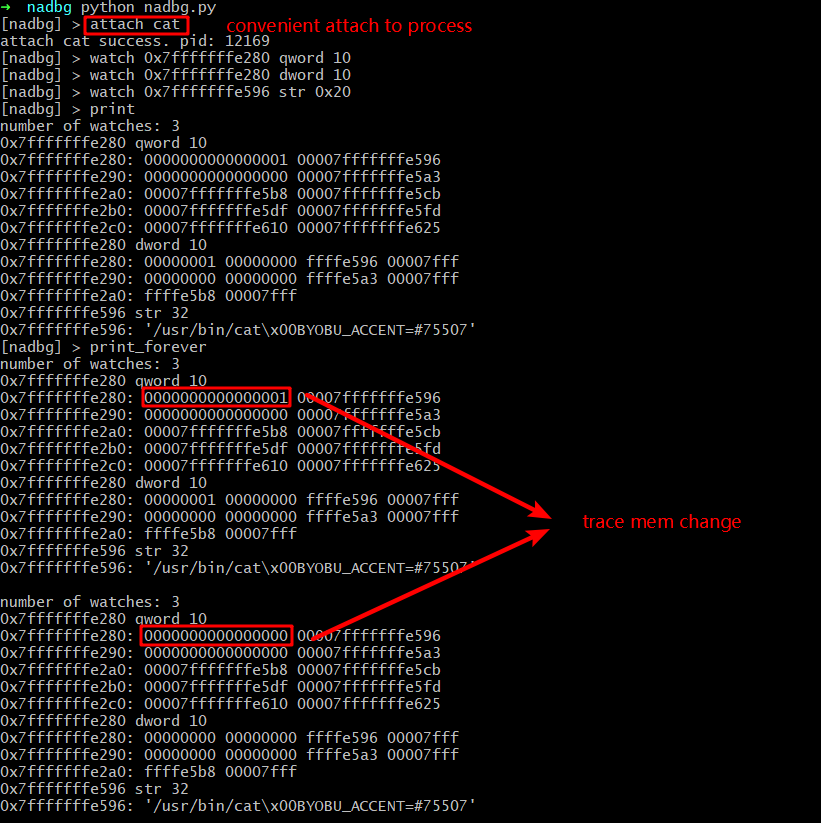

# nadbg

Not A Debugger !

But a memory watcher and something more !

Let's have a preview.



This project is still in development.

# usage

Start this appilication.

```py
python nadbg.py
```

Use `help` or `?` to get some help.

```raw
[nadbg] > ?
ctrl+d: exit
ctrl+c: stop command
wd (alias): watch dword
wb (alias): watch byte
q (alias): exit
p (alias): print
ws (alias): watch str
at (alias): attach
wq (alias): watch qword
? (alias): help
print_forever: print out all watch point information when there is a change.
    use `set interval 0.5` to let it check each 0.5 sec. default is 1.

set: set global values.
    args:
        key: key
        val: val

help: print help message
watch: set memory watch point for the attached process.
    args:
        typ: supported type -- byte str int dword qword ptr size_t
        addr: the address you want to set watch point. (e.g. 0x602010  0x7fff8b4000)
        size: total_size = sizeof(typ) * size

attach: attach to a process. name and pid are supported
    args:
        s: a binary name or its pid, also support path

exit: not documented
print: print out all watch point information. no args needed.
```

## what for ?

- memory watcher (instead of `x /gx` in gdb)
- heap analyzer (not implemented yet)
- other